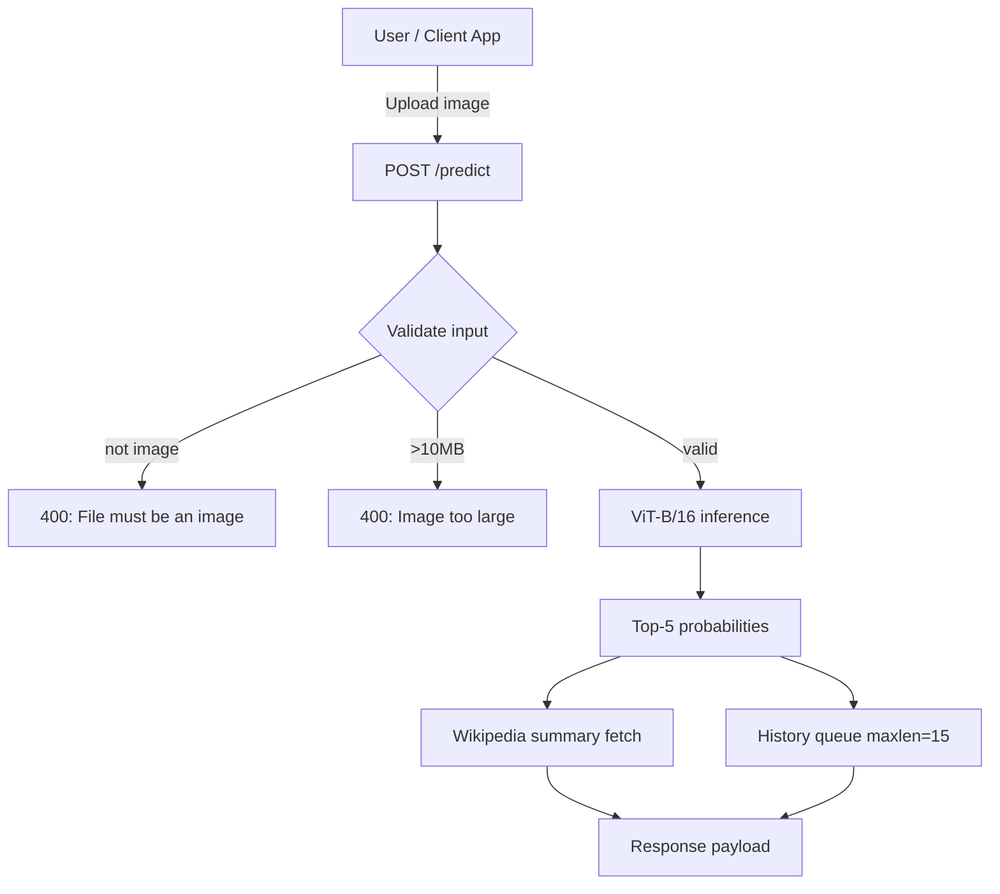

<div align="center">

# 𓅃 **BIRD ATLAS**
### *A fine-grained species intelligence API built on ViT-B/16*


</div>

---

## ◆ Design Intent
This README follows a **field-journal / atlas** aesthetic: concise technical precision wrapped in editorial structure and high-contrast visual hierarchy. It documents the real system implemented in this repository and the SRS (`Bird_Classification_SRS.pdf`) without changing runtime code.

---

## ◆ What This System Does
The service classifies uploaded bird photos into fine-grained species classes and returns structured inference output.

- **Image input** via multipart upload.
- **Top-k species predictions** (ranked by confidence).
- **Wikipedia enrichment** for the best class.
- **Recent inference history** (memory-backed queue).
- **Operational routes** for root and health checks.

---

## ◆ System Blueprint



---

## ◆ Stack Matrix

| Layer | Choice |
|---|---|
| API Runtime | FastAPI + Uvicorn |
| ML Core | PyTorch + timm + torchvision |
| Image Pipeline | Pillow |
| Model Artifact Source | Hugging Face Hub |
| External Knowledge API | Wikipedia REST Summary |
| Container Base | `python:3.11-slim` |
| Runtime Pin | `python-3.11.0` |

---

## ◆ Model Card (Implementation-Aligned)

### Backbone
- `vit_base_patch16_224` from `timm`.

### Classification Head
- `LayerNorm(embed_dim)`
- `Dropout(0.3)`
- `Linear(embed_dim → 512)`
- `GELU()`
- `Dropout(0.2)`
- `Linear(512 → num_classes)`

### Inference Behavior
- Device: **CPU**
- Transform pipeline:
  - Resize to `224×224`
  - Normalize with ImageNet stats
- Output: top-`k` predictions (`k=5` in API flow)

---

## ◆ Dataset Notes (SRS)
- Dataset: **CUB-200-2011 (Caltech-UCSD Birds)**
- Scope: **200 species classes**
- Problem type: **fine-grained visual categorization**

---

## ◆ API Contract

### `GET /`
Health-style root ping.

```json
{
  "status": "ok",
  "message": "Bird Classifier API is running!"
}
```

### `POST /predict`
Classify one uploaded image and enrich response with Wikipedia metadata.

#### Request
- Content type: `multipart/form-data`
- Field: `file`
- Constraints:
  - Must be `image/*`
  - Max size: `10MB`

#### Response (shape)
```json
{
  "predictions": [
    {
      "rank": 1,
      "label": "American Goldfinch",
      "raw_label": "AMERICAN_GOLDFINCH",
      "confidence": 97.41
    }
  ],
  "wikipedia": {
    "title": "American goldfinch",
    "summary": "...",
    "url": "https://en.wikipedia.org/wiki/American_goldfinch",
    "image": "https://..."
  },
  "top_label": "American Goldfinch",
  "top_conf": 97.41
}
```

#### Error Modes
| Condition | HTTP | Message |
|---|---:|---|
| Upload is not an image | 400 | `File must be an image` |
| Image exceeds size limit | 400 | `Image too large (max 10MB)` |

### `GET /history`
Returns the latest prediction entries (in-memory, max **15**).

### `GET /health`
Operational check with class count.

```json
{
  "status": "healthy",
  "classes": 200
}
```

---

## ◆ Quickstart

### 1) Install dependencies
```bash
pip install -r requirements.txt
```

### 2) Run server
```bash
uvicorn main:app --host 0.0.0.0 --port 7860
```

### 3) Open interactive docs
- Swagger UI → `http://localhost:7860/docs`
- ReDoc → `http://localhost:7860/redoc`

---

## ◆ cURL Smoke Test

```bash
curl -X POST "http://localhost:7860/predict" \
  -H "accept: application/json" \
  -H "Content-Type: multipart/form-data" \
  -F "file=@/path/to/bird.jpg"
```

---

## ◆ Docker

```bash
docker build -t bird-atlas-api -f Dockerfile.txt .
docker run --rm -p 7860:7860 bird-atlas-api
```

---

## ◆ Repository Layout

```text
bird-app/
├── Bird_Classification_SRS.pdf   # System requirements source document
├── main.py                       # FastAPI routes, validation, history, wiki fetch
├── model.py                      # Model download, construction, and inference
├── requirements.txt              # Runtime dependencies
├── Dockerfile.txt                # Container build + launch
├── runtime.txt                   # Python runtime pin
└── README.md                     # This document
```

---

## ◆ Non-Functional Characteristics
- Stateless API surface except for ephemeral in-memory history.
- CORS currently configured with wildcard origins.
- Startup depends on pulling model assets from Hugging Face Hub.
- Wikipedia enrichment is best-effort with graceful fallback behavior.

---

## ◆ Roadmap Suggestions
- Persistent history storage (SQLite/Postgres).
- Auth + request throttling.
- Background queue for heavy inference workloads.
- Optional GPU worker profile.
- Observability: structured logs + metrics dashboard.

---

## ◆ Author & Attribution
Per SRS document metadata:
- **Devansh Gupta**

---

## ◆ License
No explicit `LICENSE` file is currently present in the repository.
